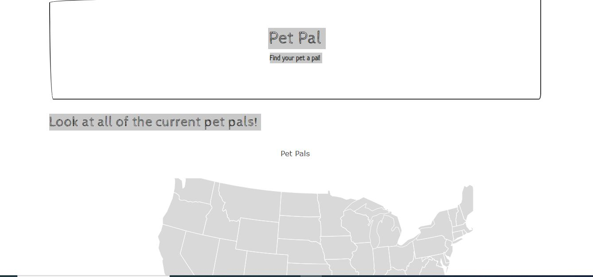
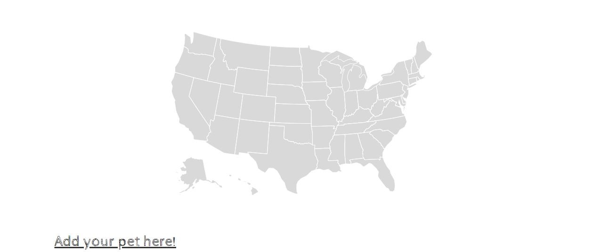

# Pet_Pals

Application written in JavaScript, HTML, and CSS that enables the user to add their pets to a a map of the United States using latitude and longitude.

# How to Run Code:

1. Navigate to https://samspets.herokuapp.com/

2. Enjoy!

# Screenshots

1. 

Screenshot of top half of application (non-interactive).

2. 

Screenshot of bottom half of application allowing user to add their pet to the map
